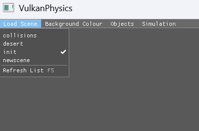

# 700106 / 700120 Lab Book

## Week 2 - Lab 2
### Q1. Loading and Unloading Scenes

**Question:**
Use IMGUI to load and modify scenes.

**Solution:**



On start up, the "init" scene is loaded in.

```
├───collisions
│       scene.cfg
│       settings.cfg
│
├───desert
│       scene.cfg
│       settings.cfg
│
├───init
│       scene.cfg
│       settings.cfg
│
└───newscene
        scene.cfg
        settings.cfg
```

The scenes are picked from a config folder, where each subfolder contains information of global settings, camera positions and object positions.

```
ProceduralTexture tex_checker_floor
    Type Checker
    Color1 1.0 0.0 0.0 1.0   # Red
    Color2 0.0 0.0 1.0 1.0   # Blue
    Size 512
    CellSize 64
EndTexture

Object FloorPlane
    Type Model
    Model models/plane.sjg
    Texture tex_checker_floor  
    Position 0.0 0.0 0.0
    Rotation -90.0 0.0 0.0 
    Scale 3.0 3.0 3.0
    RenderProps 1 true true true 3
    PhysicsProps false true
EndObject

Object MainLight
    Type Sphere
    Params 0.5
    Position 0.0 20.0 0.0
    Light true 1.0 1.0 1.0 1.5 2
    RenderProps 1 false false true 3
    PhysicsProps false false
EndObject
```

The menu is drawn in the main loop, and returns the name of the scene the user selects.
```cpp
std::string nextScene = editorUI->Draw(deltaTime,
    scene->GetWeatherIntensity(),
    scene->GetSeasonName(),
    *scene);

if (!nextScene.empty()) {
    LoadScene(nextScene);
}

void Application::LoadScene(const std::string& scenePath) {
    if (vulkanDevice) {
        vkDeviceWaitIdle(vulkanDevice->GetDevice());
    }

    if (scene) {
        scene->Clear();
    }

    config = ConfigLoader::Load(scenePath);
    SetupScene();
    cameraController = std::make_unique<CameraController>(config.customCameras);

    if (renderer && scene) {
        renderer->SetupSceneParticles(*scene);
    }

    std::cout << "Loaded Scene: " << scenePath << std::endl;
}
```

**Sample output:**


**Reflection:**


**Questions:**

##
### Q1. 

**Question:**


**Solution:**


**Sample output:**


**Reflection:**


**Questions:**

##
### Q1. 

**Question:**


**Solution:**


**Sample output:**


**Reflection:**


**Questions:**
